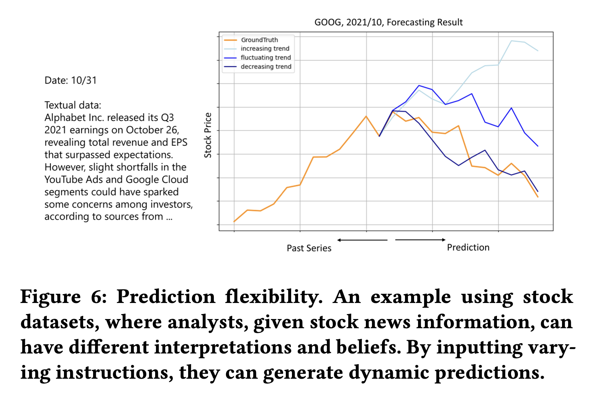
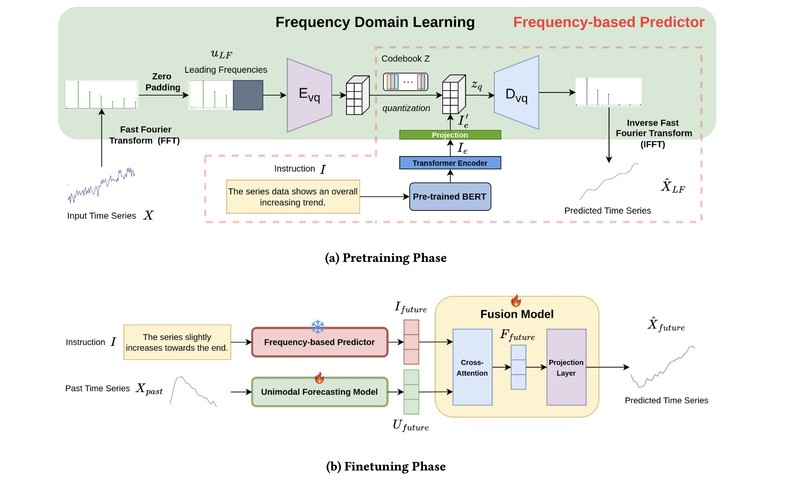

# Text2Freq (Under Review)

### This is an official implementation of **Text2Freq: Instruction-Following Time Series Forecasting via Frequency Domain Learning**.

:triangular_flag_on_post: The complete codes, including ablation studies, will be released upon paper acceptance.

:triangular_flag_on_post: Partial datasets, including first-stage pretraining and second-stage overall fusion, are available in this repository.

:triangular_flag_on_post: A preliminary version of **Text2Freq** has been accepted at **NeurIPS 2024: Time Series in the Age of Large Models** ([arXiv link](https://arxiv.org/abs/2411.00929)). The latest version is currently under review.

---

## Instruction-Following Forecasting

In this paper, we introduce an innovative yet critical task for real-world applications: **instruction-Following Time Series Forecasting**. Our approach integrates human-specified instructions (e.g., 'the series may increase in the near future') with past numerical observations to predict future dynamics.

<p align="center">
  
  
</p>


## Model Architecture

To tackle three key challenges in multimodal instruction-following forecasting, we propose a Pretraining-Finetuning framework that (1) aligns textual and time series representations in the frequency domain, (2) captures high-level patterns from dominant frequency components, and (3) leverages pretraining to address data scarcity. Our training pipeline consists of two stages:

1. **Pretraining Phase**: Pretrain a Frequency-based predictor that maps instructions to time series dynamics.

2. **Finetuning Phase**: The pretrained frequency-based predictor is integrated with a unimodal time series forecasting model to generate final predictions.

<p align="center">
  
</p>

---

## Getting Started

We seperate our codes for pretraining and finetuning into 2 folders: ```Text2Freq_Pretrain``` and  ```Text2Freq_Fusion```. Please follow the instructions below to reproduce the results from our paper.

### Requirements

- Python 3.x
- Install dependencies using:`pip install -r environment.txt`
 
We also provide pretrained model weights for the pretraining stage, available at [Model Weight](https://drive.google.com/drive/folders/15rib7qGjYhzb7Z_ZNzlJfQJ0eEiPxsFQ?usp=sharing). Feel free to download them and directly evaluate the results.

- For the pretraining stage, place the `pretrain` and `vqvae` folders under `model_path` in `Text2Freq_Pretrain`.
- For the finetuning stage, place the `pretrain` and `vqvae` folders under `pre_weight` in `Text2Freq_Fusion`.

### Pretraining

The pretraining stage includes the VQ-VAE model and the Transformer encoder. 

Run the pretraining script:
```
sh ./run_pretraining.sh
```

You can adjust hyperparameters based on your needs (e.g. different leadning frequency components and different series lengths).

### Finetuning

The finetuning code structure mainly follows **TSFLib**, focusing on the forecasting task. We add different model settings to support various unimodal models and ablation studies.

To run the finetuning stage with different datasets:
```
bash ./scripts/month_traffic.sh 0 3
```

You can replace the dataset by selecting different scripts from the `scripts` folder, each with different configurations.

---

## Acknowledgement

We appreciate the following github repo very much for the valuable code base and datasets:

https://github.com/AdityaLab/Time-MMD

https://github.com/AdityaLab/MM-TSFlib

https://github.com/thuml/iTransformer

https://github.com/vivva/DLinear

https://www.dropbox.com/scl/fo/zctja07myvwfrv8byu4gn/AO4lILVlUneO3rr-1X_ppCM?rlkey=vntqwdnpdcp6d40z50ymhxy0q&e=1&dl=0

https://github.com/yuqinie98/PatchTST

---

## Contact

If you have any questions or concerns, please contact us: max230620089@gmail.com
