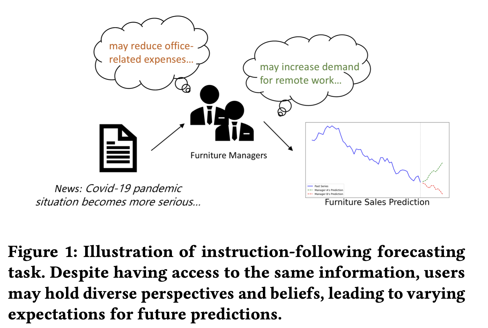

# Text2Freq (Under Review)

### This is an official implementation of **Text2Freq: Instruction-Following Time Series Forecasting via Frequency Domain Learning**.

:triangular_flag_on_post: The complete codes, including ablation studies, will be released upon paper acceptance.

:triangular_flag_on_post: Partial datasets, including first-stage pretraining and second-stage overall fusion, are available in this repository.

:triangular_flag_on_post: A preliminary version of **Text2Freq** has been accepted at **NeurIPS 2024: Time Series in the Age of Large Models** ([arXiv link](https://arxiv.org/abs/2411.00929)). The latest version is currently under review.

---

## Instruction-Following Forecasting

In this paper, we introduce an innovative yet critical task for real-world applications: **instruction-Following Time Series Forecasting**. Our approach integrates human-specified instructions (e.g., 'the series may increase in the near future') with past numerical observations to predict future dynamics.

  
  

---

## Model Architecture

To tackle three key challenges in multimodal instruction-following forecasting, we propose a Pretraining-Finetuning framework that (1) aligns textual and time series representations in the frequency domain, (2) captures high-level patterns from dominant frequency components, and (3) leverages pretraining to address data scarcity. Our training pipeline consists of two stages:

1. **Pretraining Phase**: Pretrain a Frequency-based predictor that maps instructions to time series dynamics.

2. **Finetuning Phase**: The pretrained frequency-based predictor is integrated with a unimodal time series forecasting model to generate final predictions.

  

---
